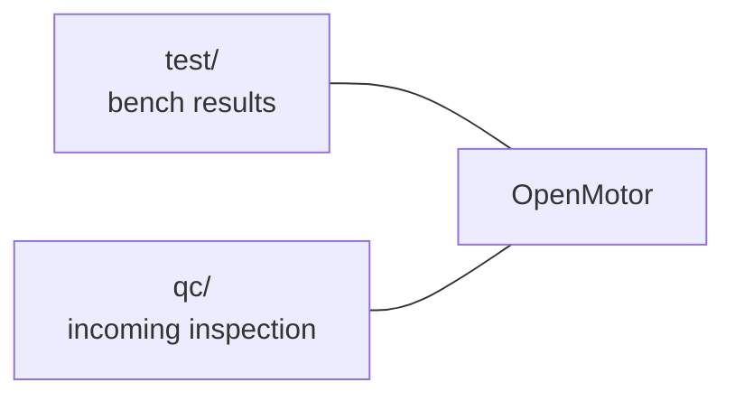

# OpenMotor

Brushless motors for the [OpenFrame](https://github.com/OpenDrone-hw/OpenFrame-5F) 3" and 5" quads. Sold per motor, 4 per quad, each wound for 4S or 6S.

OpenMotor is an OEM motor: an existing motor platform from an OEM motor maker with a custom OpenDrone bell and gold and green anodising. It is not an open motor design. This repository does not hold the motor design. It holds what OpenDrone measures and checks on the motors it sells.

## Variants

Specs are the figures on the [storefront page](https://opendrone.be/products/openmotor). They are the maker's figures, not OpenDrone measurements. "Not yet measured" means the storefront gives no value.

| Frame | Stator | Cells | KV | Config | Shaft | Mount | Weight | Max current | Max power |
|---|---|---|---|---|---|---|---|---|---|
| OpenFrame 3" | 1604 | 6S | 2850 | 12N14P | 1.5 mm | 9 x 9 mm, M2 | 11.6 g | 15.8 A | 395 W |
| OpenFrame 3" | 1604 | 4S | 3800 | not yet measured | not yet measured | not yet measured | not yet measured | not yet measured | not yet measured |
| OpenFrame 5" | 2306 | 6S | 1950 | not yet measured | not yet measured | not yet measured | not yet measured | not yet measured | not yet measured |
| OpenFrame 5" | 2306 | 4S | 2550 | not yet measured | not yet measured | not yet measured | not yet measured | not yet measured | not yet measured |

The bell carries the OpenDrone logo and the gold and green anodising. Box contents per variant are on the storefront page.

## Status

| | |
|---|---|
| Sale | Preorder on [opendrone.be/products/openmotor](https://opendrone.be/products/openmotor) |
| Shipping | Ships by 31 March 2027 if the preorder target is reached by 15 December 2026, per the storefront |
| Bench results | None yet. The first results come from the sample run. |
| Incoming QC | Draft procedure in [`qc/`](qc/README.md), not yet used on a delivery |
| Bell drawing | Not in this repository |

## What this repository holds

| Folder | Content |
|---|---|
| [`test/`](test/README.md) | Bench results per variant and serial, and the file format |
| [`qc/`](qc/README.md) | Incoming inspection procedure and record sheet |

## Licence

Everything in this repository is licensed under [CERN-OHL-S-2.0](https://ohwr.org/cern_ohl_s_v2.txt), see [LICENSE](LICENSE). The licence covers OpenDrone's tests and procedures, not the OEM motor design. Contributing: [CONTRIBUTING.md](CONTRIBUTING.md).
